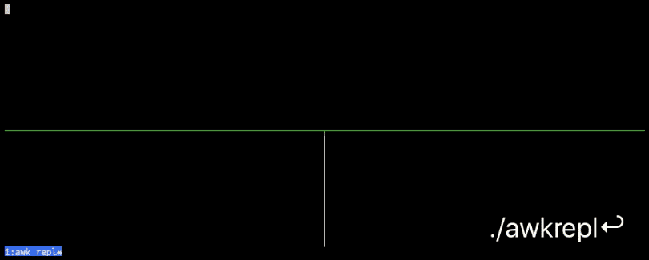

awkrepl
=======



A (work-in-progress) [REPL][1] for [AWK][2].

Syntax-checks and pretty-prints your AWK code in the lower right-hand pane when
you save it, and shows the results of your program's execution in the
lower-left. The top pane is your text editor (whatever you have `$EDITOR` set
to, or defaults to `nano`), with the file `~/.repl.awk` open for editing.

Any lines after `#DATA` at the end of the program are supplied as input to your
program, for quick testing on sample inputs.

`awkrepl` automatically wrap simple programs like `print $1` in `END{…}` for
you, so it's a piece of cake to try out little snippets of AWK code.

Some (dubious) heuristics are applied when deciding whether to automatically
apply an outer set of curly braces for you, so that if your script contains
something like

```awk
/^r/

# or
NF>1
```

where the `{print}` is implicit, this should work as expected.


Requirements
------------

* Docker
* _—or—_ tmux, [entr][], (GNU) awk, and Perl
    * also [bat][], if you want your pretty-printed AWK source to also be
      syntax-highlighted


Usage
-----

If you have all the prereqs and want to run it without Docker, simply make the
`awkrepl` script executable with `chmod a+x` (if it's not already) and put it
somewhere in your search path, like `$HOME/bin`. Run `awkrepl`.

Otherwise, for Docker:

```bash
make build
# or, if you don't have 'make'
docker build -t awkrepl

make run
# or
docker run -it --rm awkrepl
```

The `make run` target will respect your existing `EDITOR` environment variable,
defaulting to `nano` if it's not set. You can specify a different editor like
this:

```
make run EDITOR=vim

# or
docker run -it -e EDITOR=vim --rm
```

There's no GNU Emacs in the Docker image to keep the size down, but 
there's [jove][], which installs itself as `emacs`, and that'll do in a pinch.
You could always modify the Dockerfile and `make build`!

It's also possible to run straight from [Docker Hub][hub], if that's your
thing:

```bash
docker run -it -e EDITOR=emacs --rm ernstki/awkrepl
```

The image is about ~65 MB compressed, and based on [debian:stable-slim][slim].


Bugs
----

The whole script _probably_ should've just been written in Perl.

Please [report any issues][issues] you find, though.


See also
--------

* <https://en.wikipedia.org/wiki/AWK>
* <https://en.wikipedia.org/wiki/Read%E2%80%93eval%E2%80%93print_loop>
* <https://www.grymoire.com/Unix/Awk.html>


Author
------

Kevin Ernst ([ernstki -at- mail.uc.edu](mailto:ernstki%20-at%20mail.uc.edu))


License
-------

MIT.


[1]: https://en.wikipedia.org/wiki/Read%E2%80%93eval%E2%80%93print_loop
[2]: https://en.wikipedia.org/wiki/AWK
[entr]: http://eradman.com/entrproject/
[bat]: https://github.com/sharkdp/bat
[jove]: https://www.emacswiki.org/emacs/Jove
[slim]: https://hub.docker.com/_/debian
[hub]: https://hub.docker.com/repository/docker/ernstki/awkrepl
[issues]: https://github.com/ernstki/awkrepl/issues
